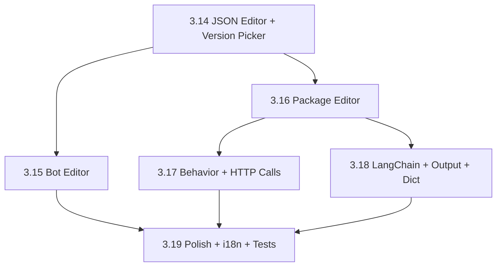

# Phases 3.14–3.19 — Editing Layer for EDDI Manager

The current Manager UI (Phases 3.1–3.13) is a **read-only dashboard**. This plan adds the full **editing layer** — the core value of the Manager.

---

## Backend API Summary

All extension types follow a **uniform CRUD pattern**:

| Endpoint                                                | Verb   | Description                         |
| ------------------------------------------------------- | ------ | ----------------------------------- |
| `GET /{store}/descriptors`                              | GET    | List all configs                    |
| `GET /{store}/{id}?version=N`                           | GET    | Read config                         |
| `PUT /{store}/{id}?version=N`                           | PUT    | Update config (creates new version) |
| `POST /{store}`                                         | POST   | Create new config                   |
| `POST /{store}/{id}?version=N`                          | POST   | Duplicate                           |
| `DELETE /{store}/{id}?version=N`                        | DELETE | Delete                              |
| `GET /{store}/jsonSchema`                               | GET    | JSON Schema for validation          |
| `POST /administration/{env}/deploy/{botId}?version=N`   | POST   | Deploy bot                          |
| `POST /administration/{env}/undeploy/{botId}?version=N` | POST   | Undeploy bot                        |
| `GET /extensionstore/extensions`                        | GET    | List available task types           |

**Extension store paths:**

| Type               | Path                                          | Config Model                     |
| ------------------ | --------------------------------------------- | -------------------------------- |
| Behavior Rules     | `/behaviorstore/behaviorsets`                 | `BehaviorConfiguration`          |
| HTTP Calls         | `/httpcallsstore/httpcalls`                   | `HttpCallsConfiguration`         |
| LangChain          | `/langchainstore/langchains`                  | `LangChainConfiguration`         |
| Output             | `/outputstore/outputsets`                     | `OutputConfiguration`            |
| Property Setter    | `/propertysetterstore/propertysetters`        | `PropertySetterConfiguration`    |
| Regular Dictionary | `/regulardictionarystore/regulardictionaries` | `RegularDictionaryConfiguration` |
| Parser             | `/parserstore/parsers`                        | `ParserConfiguration`            |
| Properties         | `/propertiesstore/properties`                 | `PropertiesConfiguration`        |

---

## Proposed Changes

### Phase 3.14 — Shared JSON Editor & Version Picker

Foundation components needed by all editing phases.

#### [NEW] `src/components/editors/json-editor.tsx`

Monaco-based JSON editor with schema validation, syntax highlighting, diff view.
Uses `@monaco-editor/react` package.

#### [NEW] `src/components/editors/config-editor-layout.tsx`

Shared layout: header (name, version picker, save/cancel), tabs (Form | JSON), dirty-state indicator, optimistic save with error toast.

#### [NEW] `src/components/ui/version-picker.tsx`

Dropdown showing all versions of a resource. Calls `GET /descriptors?includePreviousVersions=true`.

#### [MODIFY] `src/lib/api/bots.ts`

Add `updateBot()`, `duplicateBot()`, `deleteBot()` API functions.

#### [MODIFY] `src/lib/api/packages.ts`

Add `updatePackage()`, `duplicatePackage()`, `deletePackage()` API functions.

#### [NEW] `src/lib/api/extensions.ts`

Typed API module for all 8 extension types. Single generic `createExtensionApi(storePath)` factory.

#### [NEW] `src/hooks/use-extensions.ts`

TanStack Query hooks wrapping extension CRUD (read, update, create, delete, duplicate).

---

### Phase 3.15 — Bot Editor (Edit, Deploy, Undeploy)

#### [MODIFY] `src/pages/bot-detail.tsx`

- **Edit mode**: inline-edit name/description, save via `PUT /botstore/bots/{id}`
- **Package list**: add/remove package URIs from `BotConfiguration.packages[]`
- **Deploy/Undeploy**: wire buttons to `POST /administration/{env}/deploy/{botId}` and `POST /administration/{env}/undeploy/{botId}`
- **Deployment status**: poll `GET /administration/{env}/deploymentstatus/{botId}`
- **Duplicate**: wire to `POST /botstore/bots/{id}?deepCopy=true`
- **Version picker**: select between versions

#### [NEW] `src/lib/api/administration.ts`

API module: `deployBot()`, `undeployBot()`, `getDeploymentStatus()`, `getDeploymentStatuses()`.

#### [NEW] `src/hooks/use-administration.ts`

TanStack Query mutations for deploy/undeploy with polling for status.

---

### Phase 3.16 — Package Editor (Extension Pipeline Builder)

This is the most complex phase. A Package is an ordered list of extension URIs (the "pipeline").

#### [MODIFY] `src/pages/package-detail.tsx`

- **Pipeline view**: drag-and-drop sortable list of extensions (each shows type icon + name)
- **Add extension**: dropdown sourced from `GET /extensionstore/extensions`, creates new config via POST, then adds URI to package
- **Remove extension**: removes URI from `packages.packageExtensions[]` and optionally deletes the config
- **Click extension**: navigates to the extension-specific editor (Phase 3.17–3.18)
- **Save**: `PUT /packagestore/packages/{id}` with updated `PackageConfiguration`

#### [NEW] `src/components/editors/pipeline-builder.tsx`

Drag-and-drop extension list using `@dnd-kit/core`. Each item shows: extension type icon, display name, actions (edit, remove, reorder).

#### [NEW] `src/components/editors/add-extension-dialog.tsx`

Modal listing available extension types from `/extensionstore/extensions`. Groups by category. Creates new extension config on selection.

---

### Phase 3.17 — Extension Editors: Behavior Rules & HTTP Calls

The two most complex extension types get dedicated form editors.

#### [NEW] `src/pages/extension-editor.tsx`

Generic wrapper: loads config by type + ID + version, renders the right editor component, handles save.

#### [NEW] `src/components/editors/behavior-editor.tsx`

- **Rule list**: collapsible cards, each with name, conditions, actions
- **Condition builder**: type selector (inputMatches, contextMatches, actionMatches, connector, negation, occurrence, dynamicValue), field inputs per type
- **Action editor**: list of action strings (add/remove)
- **Save**: `PUT /behaviorstore/behaviorsets/{id}`

#### [NEW] `src/components/editors/httpcalls-editor.tsx`

- **Call list**: named HTTP call configs
- **Per-call form**: URL template, method, headers (key-value), body template, pre/post request instructions
- **Action binding**: which actions trigger this call
- **Save**: `PUT /httpcallsstore/httpcalls/{id}`

---

### Phase 3.18 — Extension Editors: LangChain, Output, Property Setter, Dictionary

#### [NEW] `src/components/editors/langchain-editor.tsx`

- **Mode toggle**: Legacy Chat vs Agent
- **Model config**: provider, model name, API key, temperature, max tokens
- **Agent config**: system prompt, tool selection, instructions
- **Save**: `PUT /langchainstore/langchains/{id}`

#### [NEW] `src/components/editors/output-editor.tsx`

- **Output groups**: keyed by action name
- **Per-output**: type (text/image/quickReplies), value list with random selection indicator
- **Save**: `PUT /outputstore/outputsets/{id}`

#### [NEW] `src/components/editors/propertysetter-editor.tsx`

- **Setter list**: action + property key + value expression
- **Save**: `PUT /propertysetterstore/propertysetters/{id}`

#### [NEW] `src/components/editors/dictionary-editor.tsx`

- **Word/phrase list**: input → expression mapping
- **Regex support**: regex patterns with named groups
- **Save**: `PUT /regulardictionarystore/regulardictionaries/{id}`

> [!NOTE]
> Parser and Properties editors are lower priority — can start with JSON-only editor using the shared Monaco component from Phase 3.14.

---

### Phase 3.19 — Polish, i18n, Tests & Documentation

#### i18n

- Add all new editor labels to all 11 locale files (~100+ new keys per locale)
- Key parity tests will catch any drift

#### Tests

- Unit tests for each editor component (render, form validation, save flow)
- MSW handlers for all extension CRUD endpoints
- Integration tests for bot deploy/undeploy flow

#### Documentation

- Update HANDOFF.md with Phases 3.14–3.19
- Changelog entries for each phase
- Update manager README with editor architecture overview

---

## Verification Plan

### Automated Tests

```bash
npx tsc -b                # Zero errors
npm run test              # All tests pass
npm run build             # Production build succeeds
```

### Manual Verification

For each phase:

1. Create a new resource via the form UI
2. Edit the resource, change fields, save → verify config persists
3. Use JSON editor tab → edit raw JSON → save → verify form reflects changes
4. Version picker → switch to older version → verify read-only
5. Deploy/undeploy a bot → verify status updates

---

## Dependency Order



## Confirmed Decisions

> [!NOTE]
> **Monaco Editor** (`@monaco-editor/react`) — **Approved**. Provides syntax highlighting, JSON schema validation, and diff view for the best editing UX.

> [!NOTE]
> **Drag-and-drop** (`@dnd-kit/core`) — **Approved**. Used for the pipeline builder in Phase 3.16 for intuitive extension reordering.
