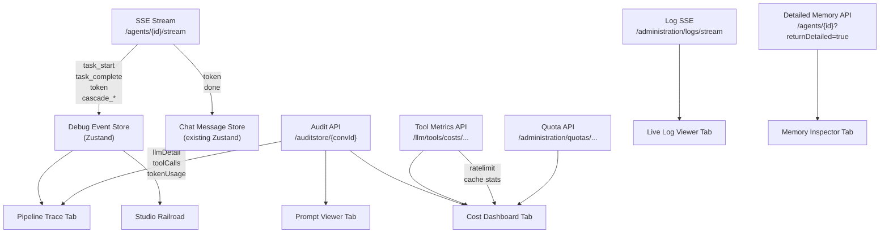

# Phase 13 — Agent Studio: Build, Edit & Debug Experiences

## Problem Statement

EDDI's backend emits **rich real-time data** that the frontend largely ignores:

| Backend Data Source | API Endpoint | What It Contains | Currently Used in Manager? |
|---|---|---|---|
| **SSE lifecycle events** | `POST /agents/{id}/stream` | `task_start`, `task_complete` (with actions, duration), `token`, `cascade_step_start`, `cascade_escalation` | ❌ Only `token` rendered; `task_*` events toggle a single "thinking" boolean |
| **Tool execution history** | `GET /llm/tools/history/{convId}` | Per-tool calls with args, results, execution time, cost | ❌ Not connected |
| **Tool cost summary** | `GET /llm/tools/costs/conversation/{convId}` | Total cost, tool call count, per-tool usage breakdown | ❌ Not connected |
| **Tool rate limits** | `GET /llm/tools/ratelimit/{tool}` | Limit, remaining, reset time | ❌ Not connected |
| **Cache stats** | `GET /llm/tools/cache/stats` | Hit rate, per-tool stats | ❌ Not connected |
| **Audit entries** | `GET /auditstore/{convId}` | Per-task: input, output, `llmDetail` (compiled prompt, model response, **token usage**), tool calls, actions, cost, duration, HMAC | ❌ Only shown on separate Audit Trail page — not connected to chat/debugging |
| **Live log streaming** | `GET /administration/logs/stream` | Real-time per-agent/per-conversation log entries via SSE | ❌ Not connected |
| **Tenant quotas** | `GET /administration/quotas/{id}/usage` | Conversations/day, API calls/min, monthly cost vs caps | ❌ Only shown on admin Quotas page |
| **Detailed memory** | `GET /agents/{convId}?returnDetailed=true` | Full `ConversationStepData[]` with `originWorkflowId` per data key | ❌ Only `returnDetailed=false` used |

**The gap isn't infrastructure — it's visualization.**

---

## Design Philosophy

Rather than three abstract "pillars," I'm designing around **three UX journeys** — what does a developer actually *do* and *need to see* at each stage:

### Journey 1: "I'm building an agent and want to see my pipeline"
**Current**: Flat DnD list with step numbers. No indication of data flow.
**Desired**: A visual railroad showing extension types, resource names, and directional flow connectors. In live mode, stages animate as SSE `task_start`/`task_complete` events arrive.

### Journey 2: "I sent a message and something went wrong"
**Current**: Chat shows "thinking..." then either a response or nothing. Raw JSON expandable in conversation detail page.
**Desired**: A debug drawer under the chat showing exactly what happened — which tasks ran, how long each took, what actions were emitted, what the LLM prompt looked like, what tools were called, how many tokens were used, what it cost.

### Journey 3: "I want to understand my costs and limits"
**Current**: Token usage buried in audit entries. Tool costs live in a disconnected REST endpoint. Quota usage only on admin page.
**Desired**: A cost/usage dashboard visible during chat — tokens per turn, cumulative conversation cost, rate limit gauges, quota progress bars.

---

## Research-Backed Design Principles

From [`AI Dashboard UX Research Brief.md`](file:///c:/dev/git/EDDI-Manager/eddi-research/AI%20Dashboard%20UX%20Research%20Brief.md) and the [`research-interpretations/`](file:///c:/dev/git/EDDI-Manager/eddi-research/research-interpretations/) folder:

### What to Do (validated by competitive analysis)

| Principle | Source Insight | Our Implementation |
|---|---|---|
| **Flawless Context Snapshot** | Devs suffer "reasoning blindness" — traces show *what* but not *why*. Must show exact token-compiled prompt as LLM saw it. | **Prompt Viewer tab** (13b) shows `llmDetail.compiledPrompt` with all variables resolved |
| **Interactive Playback** | Devs want Play/Pause/Edit/Resume to test downstream resilience without restarting | EDDI already has `rerunLastConversationStep` — exposed as "Replay Turn" button |
| **Causal Trace Linkage** | Standard traces lack prompt→output→tool_call decision chain visualization | Click task bar in **Pipeline Trace** → shows audit entry with full I/O chain |
| **Virtual Scrolling** | Competitor UIs crash rendering massive logs for long-running agents | **Live Log Viewer** uses virtualized scrolling (overflow-anchor or react-window) |
| **Actionable Telemetry** | Surface `ToolCostTracker` metrics. Show "True Resolution Rate" not vanity deflection metrics | **Cost Dashboard tab** (13a) with resolution tracking |

### Anti-Patterns to Avoid (from competitors)

| Anti-Pattern | Competitor Example | Our Mitigation |
|---|---|---|
| **Spaghetti Graph** — node canvases degrade at scale | Langflow/Flowise: ~0 FPS with 100+ nodes | EDDI's sequential pipeline → **vertical railroad**, no React Flow |
| **Context-Switching PTSD** — stacked modals | Legacy MUI had 61+ modals; n8n sub-workflows hide context | Already eradicated — all config uses side sheets |
| **No-Code Black Box** — hides logic from power users | Make.com: 20 visual nodes for 3 lines of code | Every editor has Form ↔ JSON toggle via Monaco |
| **Deflection Analytics** — measuring abandonment as success | Industry-wide chatbot anti-pattern | Cost Dashboard tracks resolution, not deflection |
| **Brittle Variable Mapping** — string path refs break | n8n's `$('node').item` silently breaks on schema changes | EDDI uses typed `MemoryKey<T>` (future: cmdk palette) |

---

## Sub-Phase Strategy

Each sub-phase is independently shippable and provides immediate value:

| Sub-Phase | Scope | Key Deliverable | Estimated Files |
|---|---|---|---|
| **13a** | Pipeline Trace + Cost Dashboard | Debug drawer under chat panel with per-task timeline and cost/token metrics | ~8 new files |
| **13b** | Memory Inspector + Live Logs + Prompt Viewer | Additional debug drawer tabs for deep inspection | ~6 new files |
| **13c** | Agent Studio workspace | Three-panel layout unifying pipeline, editor, debugger | ~3 new files |

---

## Proposed Changes — Phase 13a

### Core: Debug Drawer for Chat Panel

The main UX change is adding a **collapsible debug drawer** below the chat messages area. This is NOT a separate page — it enriches the existing chat experience.

```
┌───────────────────────────────────────────┐
│  🤖 Agent Selector   [SSE] [+] [■]       │  ← existing top bar
├───────────────────────────────────────────┤
│                                           │
│  User: What's the weather?                │  ← existing messages
│  Agent: The weather is sunny...           │
│                                           │
├─────── [🔍 Debug] ────────────────────────┤  ← NEW toggle bar
│  Pipeline │ Costs │ Memory │ Logs │ Prompt│  ← NEW tab strip
│                                           │
│  ┌─Parser──┐┌─Rules──┐┌─HTTP──────┐┌─LLM─│  ← per-task Gantt bars
│  │  12ms   ││  3ms   ││  156ms    ││2.3s │
│  └─────────┘└────────┘└───────────┘└─────│
│                                           │
│  💰 Tokens: 847 in / 234 out = 1,081     │  ← token summary
│  💵 Cost: $0.0032 this turn | $0.015 conv │
│  ⚡ Rate: 42/60 calls remaining           │
│                                           │
├───────────────────────────────────────────┤
│  [Undo] [Redo]                            │  ← existing
│  [🔒] Type a message...          [Send]   │  ← existing
└───────────────────────────────────────────┘
```

**Responsive behavior:**
- **Desktop (≥1024px)**: Drawer takes 40% of chat panel height, resizable
- **Tablet (768–1023px)**: Drawer takes 35%, non-resizable
- **Mobile (<768px)**: Drawer overlays the chat as a bottom sheet (swipe up/down)

---

#### [NEW] [debug-drawer.tsx](file:///c:/dev/git/EDDI-Manager/src/components/debugger/debug-drawer.tsx)

Container component with tab strip. Manages which debug tab is active. Renders as a collapsible panel within the chat layout.

Props: `conversationId`, `agentId`, `isOpen`, `onToggle`

#### [NEW] [pipeline-trace.tsx](file:///c:/dev/git/EDDI-Manager/src/components/debugger/pipeline-trace.tsx)

**Tab 1: Pipeline Trace** — Per-turn Gantt chart of lifecycle task execution.

Data source: SSE `task_start`/`task_complete` events (live) OR audit entries (historical).

```
Turn 3 — Total: 2.47s
──────────────────────────────────────────────────
Parser         ██ 12ms
Behavior       █ 3ms
HTTP Calls     ████████ 156ms
LangChain      ██████████████████████████████████████  2,340ms
  └─ gpt-4o (step 1/1, confidence: 0.92)
Output         █ 1ms
──────────────────────────────────────────────────
Actions: [welcome, fetch_weather, send_to_ai]
```

Features:
- Proportional bar widths based on duration (min-width for <1ms tasks)
- Color-coded by task type (CSS variables matching extension icons)
- Cascade sub-steps shown as nested indented bars
- Click any bar → shows task detail popover (input/output/actions)
- Turn selector: dropdown to view historical turns, not just current

#### [NEW] [cost-dashboard.tsx](file:///c:/dev/git/EDDI-Manager/src/components/debugger/cost-dashboard.tsx)

**Tab 2: Costs & Tokens** — Real-time cost/token/limit visibility.

Data sources:
- Token usage: from audit entries `llmDetail.tokenUsage` (`inputTokens`, `outputTokens`, `totalTokens`)
- Conversation cost: `GET /llm/tools/costs/conversation/{convId}`
- Rate limits: `GET /llm/tools/ratelimit/{toolName}`
- Quota usage: `GET /administration/quotas/{tenantId}/usage`

```
┌─ This Turn ──────────────────────────────┐
│  Tokens    847 in │ 234 out │ 1,081 total│
│  Cost      $0.0032                       │
│  Duration  2.47s                         │
│  Model     gpt-4o (openai)               │
├─ Conversation Total ─────────────────────┤
│  Tokens    3,241 in │ 892 out │ 4,133    │
│  Cost      $0.015                        │
│  Tool Calls  7 (3 websearch, 4 weather)  │
├─ Rate Limits ────────────────────────────┤
│  API calls   ████████░░  42/60 per min   │
│  Daily conv  ██░░░░░░░░  23/100          │
│  Monthly $   █░░░░░░░░░  $0.15 / $10.00  │
└──────────────────────────────────────────┘
```

Features:
- Progress bars for rate limits and quota gauges (warn at 80%, critical at 95%)
- Per-turn and cumulative metrics
- Cache hit rate indicator
- Auto-refreshes during active conversation (polls cost endpoint every 5s)

#### [NEW] [use-debug-events.ts](file:///c:/dev/git/EDDI-Manager/src/hooks/use-debug-events.ts)

Custom hook that extends the existing SSE handler to capture and store structured pipeline events. Replaces the simple "thinking" toggle with a proper event log.

```typescript
interface PipelineEvent {
  type: 'task_start' | 'task_complete';
  taskId: string;
  taskType: string;
  index: number;
  durationMs?: number;
  actions?: string[];
  timestamp: number;
}

interface DebugState {
  turns: PipelineTurn[];           // per-turn event arrays
  currentTurnEvents: PipelineEvent[];
  isDebugOpen: boolean;
}
```

Key design: The hook **extends** the existing `handleSSEEvent` in `use-chat.ts` rather than duplicating the SSE connection. Events are dispatched to both the chat message handler and the debug event store.

#### [NEW] [api/tool-metrics.ts](file:///c:/dev/git/EDDI-Manager/src/lib/api/tool-metrics.ts)

API module wrapping the existing `RestToolHistory` endpoints:
- `getToolHistory(conversationId)` → tool execution traces
- `getConversationCosts(conversationId)` → cost breakdown
- `getToolRateLimit(toolName)` → rate limit info
- `getCacheStats()` → cache hit/miss rates
- `getToolCosts()` → global cost summary

#### [NEW] [use-tool-metrics.ts](file:///c:/dev/git/EDDI-Manager/src/hooks/use-tool-metrics.ts)

TanStack Query hooks for tool metrics with smart polling:
- `useConversationCosts(convId)` — polls every 5s during active conversation
- `useToolRateLimits()` — polls every 10s
- `useToolHistory(convId)` — fetches on demand

#### [MODIFY] [use-chat.ts](file:///c:/dev/git/EDDI-Manager/src/hooks/use-chat.ts)

Extend `handleSSEEvent` to dispatch `task_start`/`task_complete` events to the debug store instead of just toggling `isThinking`. Keep backward compatibility — the "thinking" indicator still works.

#### [MODIFY] [chat-panel.tsx](file:///c:/dev/git/EDDI-Manager/src/components/chat/chat-panel.tsx)

Add debug drawer toggle button and render `DebugDrawer` between messages area and input area. Toggle state persisted in `localStorage`.

#### i18n: ~40 keys across all 11 locale files for debug drawer labels, tab names, metric labels, status text.

---

## Proposed Changes — Phase 13b

---

#### [NEW] [memory-inspector.tsx](file:///c:/dev/git/EDDI-Manager/src/components/debugger/memory-inspector.tsx)

**Tab 3: Memory** — Recursive tree viewer of conversation memory.

Data source: `GET /agents/{convId}?returnDetailed=true` → `ConversationStepData[]` grouped by task type using `originWorkflowId`.

Features:
- Tree nodes: Step → Task → Data Keys (e.g., `input`, `actions`, `output`, `langchain:trace`)
- Expandable values with syntax highlighting
- Step-to-step diff mode (highlights added/removed/changed keys)
- Public/private data indicator icons

#### [NEW] [live-log-viewer.tsx](file:///c:/dev/git/EDDI-Manager/src/components/debugger/live-log-viewer.tsx)

**Tab 4: Logs** — Terminal-style live log viewer.

Data source: existing `GET /administration/logs/stream?agentId={id}` SSE endpoint.

Features:
- Auto-scrolling with "pause" button
- Level filter chips (DEBUG/INFO/WARN/ERROR)
- Text search with highlight
- Monospace font, ANSI-inspired coloring
- Agent + conversation ID filter passthrough

#### [NEW] [prompt-viewer.tsx](file:///c:/dev/git/EDDI-Manager/src/components/debugger/prompt-viewer.tsx)

**Tab 5: Prompt — "The Flawless Context Snapshot"** (research-recommended)

This is the debugger's crown jewel. It solves "reasoning blindness" by showing the **exact token-compiled prompt** as the LLM evaluated it — not the template, but the fully-resolved text with all memory variables expanded.

Data source: audit entries `llmDetail.compiledPrompt`, `llmDetail.modelResponse`, `llmDetail.modelName`, `llmDetail.tokenUsage`.

```
┌─ Prompt Snapshot (Turn 3, LangChain task) ──────────┐
│                                                      │
│  🟢 System Prompt                                    │
│  ┌──────────────────────────────────────────────────┐│
│  │ You are a helpful weather assistant. When the    ││
│  │ user asks about weather, use the fetch_weather   ││
│  │ tool. Current user: john@example.com             ││
│  └──────────────────────────────────────────────────┘│
│                                                      │
│  👤 User                                             │
│  ┌──────────────────────────────────────────────────┐│
│  │ What's the weather in Vienna?                    ││
│  └──────────────────────────────────────────────────┘│
│                                                      │
│  🤖 Assistant                                        │
│  ┌──────────────────────────────────────────────────┐│
│  │ [tool_call: fetch_weather({city: "Vienna"})]     ││
│  └──────────────────────────────────────────────────┘│
│                                                      │
│  🔧 Tool Result                                      │
│  ┌──────────────────────────────────────────────────┐│
│  │ {"temp": 22, "condition": "sunny", ...}          ││
│  └──────────────────────────────────────────────────┘│
│                                                      │
│  ── Tokens: 847 in / 234 out ── Model: gpt-4o ──    │
│  ── Cost: $0.0032 ── Duration: 2.34s ──              │
│  ── Cascade: step 1/1, confidence: 0.92 ──           │
│                                                      │
│  [📋 Copy Prompt] [🔄 Replay This Turn]              │
└──────────────────────────────────────────────────────┘
```

Features:
- **Exact compiled prompt** — fully resolved, not the template (addresses research's #1 recommendation)
- System/user/assistant/tool messages in chat-style layout with role badges
- Token usage callout (input/output/total) with cost
- Model name + provider badge
- Copy-to-clipboard for full prompt text (for debugging in external tools)
- Cascade trace: if multiple models were tried, shows each step with confidence scores
- **"Replay This Turn" button** — calls EDDI's `rerunLastConversationStep` endpoint to re-execute with modified input (Interactive Playback from research)

#### [NEW] [api/logs.ts](file:///c:/dev/git/EDDI-Manager/src/lib/api/logs.ts)

API module for log endpoints: `getRecentLogs()`, `streamLogs()` (async generator yielding SSE log events).

#### [NEW] [use-logs.ts](file:///c:/dev/git/EDDI-Manager/src/hooks/use-logs.ts)

SSE streaming hook for live logs + TanStack Query hook for historical logs.

#### i18n: ~35 keys for memory/log/prompt viewer labels.

---

## Proposed Changes — Phase 13c

---

#### [NEW] [agent-studio.tsx](file:///c:/dev/git/EDDI-Manager/src/pages/agent-studio.tsx)

Three-panel workspace at `/manage/studio/:agentId`.

```
Desktop (≥1280px):
┌──── 280px ────┬───── flex-1 ──────┬────── 380px ──────┐
│   Pipeline    │    Extension      │    Debug + Chat    │
│   Railroad    │    Editor         │    Panel           │
│   (clickable  │    (form or       │    (input bar +    │
│    stages)    │    JSON)          │     debug tabs)    │
└───────────────┴───────────────────┴────────────────────┘

Tablet (768–1279px):
┌──── 240px ────┬─────── flex-1 ─────────┐
│   Pipeline    │    Editor               │
│   (compact)   │                         │
├───────────────┴─────────────────────────┤
│   Debug + Chat (bottom drawer, 35%)     │
└─────────────────────────────────────────┘

Mobile (<768px):
┌─────────────────────────────────────────┐
│  [Pipeline] [Editor] [Debug]  ← tabs    │
│                                         │
│  Active tab content (full height)       │
└─────────────────────────────────────────┘
```

#### [NEW] [pipeline-railroad.tsx](file:///c:/dev/git/EDDI-Manager/src/components/studio/pipeline-railroad.tsx)

Visual railroad rendering for the Studio left panel. Enhanced version of the existing `pipeline-builder.tsx` with:
- Animated SVG connectors between stages
- Live SSE status overlay (running/complete/error per stage)
- Click stage → loads extension editor in center panel
- Edit mode: drag-to-reorder + add/remove (existing DnD capability)
- Read mode: clean visualization without handles

#### [MODIFY] [App.tsx](file:///c:/dev/git/EDDI-Manager/src/App.tsx)

Add route: `/manage/studio/:agentId`

#### [MODIFY] [agent-detail.tsx](file:///c:/dev/git/EDDI-Manager/src/pages/agent-detail.tsx)

Add "Open in Studio" action button.

#### [MODIFY] [sidebar.tsx](file:///c:/dev/git/EDDI-Manager/src/components/layout/sidebar.tsx)

Add "Agent Studio" navigation item under Development section.

---

## Data Flow Diagram



---

## Verification Plan

### Automated Tests

```bash
# Phase 13a
npx vitest run src/components/debugger/__tests__/debug-drawer.test.tsx
npx vitest run src/components/debugger/__tests__/pipeline-trace.test.tsx
npx vitest run src/components/debugger/__tests__/cost-dashboard.test.tsx

# Phase 13b
npx vitest run src/components/debugger/__tests__/memory-inspector.test.tsx
npx vitest run src/components/debugger/__tests__/live-log-viewer.test.tsx
npx vitest run src/components/debugger/__tests__/prompt-viewer.test.tsx

# All existing tests must still pass
npm run test && npx tsc --noEmit && npm run build
```

MSW handlers needed for:
- `GET /llm/tools/costs/conversation/:id` — mock cost data
- `GET /llm/tools/ratelimit/:tool` — mock rate limit info
- `GET /llm/tools/cache/stats` — mock cache stats
- `GET /administration/logs` — mock log entries
- `GET /agents/:id?returnDetailed=true` — mock detailed memory

### Browser Testing
- Debug drawer toggle + responsive behavior at 3 breakpoints
- Pipeline trace renders proportional bars from mock SSE events
- Cost dashboard shows token counts and rate limit gauges
- Dark mode compatibility for all new components
